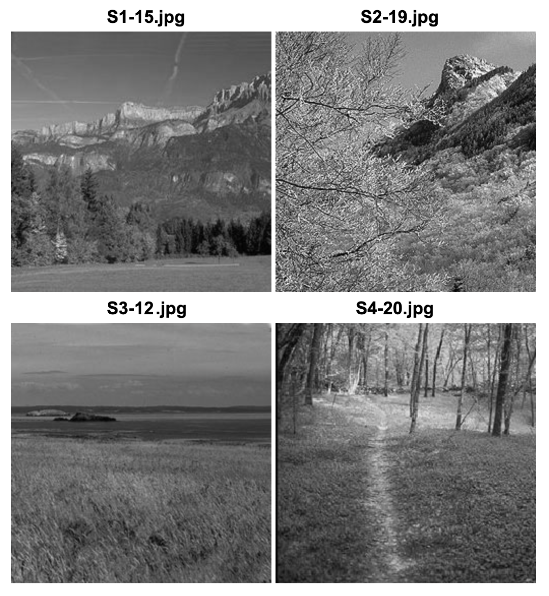

this notebook is devoted to investigating how individual subjects performed during calibration, learning, and inference. key questions that it aims to address are:

1. what do the staircases look like during calibration?
2. what coherence levels did each subject observe for each stimulus?
3. how accurately were they making button presses during learning?
4. what do their RTs look like during learning?
5. are the learned choice probabilities reflected in decision accuracy?

```{r load packages, include=FALSE}
knitr::opts_chunk$set(warning = FALSE, message = FALSE) 
library(tidyverse)
library(patchwork)
library(lme4)
library(lmerTest)
library(emmeans)
library(knitr)

# potentially useful in the future
library(performance) # for easy model comparisons
# library(jtools) # for alternative model summaries
library(sjPlot) # for formatting model result tables
# library(MetBrewer) # for pretty art-inspired color palettes
```

```{r plotting setup: colors, outdir, functions, include=F}
colors <- c('incongruent' = "#F8766D", 'neutral' = "#00BA38", 'congruent'="#619CFF")
```


```{r load & tidy calibration data, include=FALSE}
# get info about which staircase generated which coherence
staircase_df <- read.csv('../../data/tidied/staircases.csv') %>% 
  pivot_longer(cols = c(stair1, stair2), names_to = 'staircase') %>%
  rename(coherence = value) %>%
  mutate(coherence = round(coherence, 2)) 

# load calibrated coherences
calibrated_coherence <- read.csv('../../data/tidied/calibrated_coherence.csv') %>%
  mutate(img1Coh = round(img1, 2),
         img2Coh = round(img2, 2))

col_order <- c('subID', 'img1Path', 'img1Coh', 'img2Path', 'img2Coh')
calibrated_coherence <- calibrated_coherence[, col_order]
```


## calibration data

### what do the staircases look like during calibration?
solid line indicates the level of decision accuracy we are calibrating to.
```{r plot calibration data, echo=F, fig.height=10, fig.width=10, fig.dpi=300}

staircase_df %>%
  mutate(subID = paste0('sub', subID),
         targetIdx = paste0('img', imgPath)) %>% 
  ggplot(aes(x=trial, y=coherence, color=staircase)) +
  facet_wrap(subID ~ targetIdx, ncol=6) +
  geom_line(linewidth=1) +
  theme_bw() +
  geom_hline(yintercept = 0.7)

```

### what coherence levels did each subject observe for each stimulus?
coherence values that obtained 70% accuracy for each image for each subject:
```{r display calibrated coherence, echo=F}

kable(calibrated_coherence)

```

```{r, out.width='350px', echo=F, fig.align='center'}



```

***

## learning data
```{r load & tidy learning data, include=F}
learning_files = list.files('../../data', full.names = TRUE, pattern='block1_learning.csv', recursive = T)
learning_keep_idx <- grep('excluded', learning_files, invert=T)
learning_df = do.call(rbind, lapply(learning_files[learning_keep_idx], function(x) { read.csv(x, header = TRUE)} )) 

# transform RTs
learning_df <- learning_df %>%
  group_by(subID) %>%
  mutate(logRT = log(RT),
         zlogRT = scale(logRT),
         cueIdx = factor(cueIdx))
```

### how accurately were they making button presses during learning?
```{r learning accuracy, echo = F, fig.height=3, fig.width=10}
learning_df %>%
  mutate(imageIdx = factor(imageIdx)) %>% 
  ggplot(aes(x=imageIdx, y=accuracy)) +
  theme_bw() +
  facet_grid(~ subID) +
  stat_summary(fun='mean', geom='point', size=3) +
  geom_hline(yintercept = 0.8, linetype='dashed') +
  scale_y_continuous(n.breaks=6) +
  theme(text = element_text(size=14))
```

### what do their RTs look like during learning?
```{r learning RTs, echo = F, fig.dpi=300, fig.height=3}
# plot group regressions
learning_df %>%
  mutate(cueIdx = case_when(cueIdx=='1' ~ '80% A',
                            cueIdx=='2' ~ '80% B',
                            cueIdx=='3' ~ '50% A/B')) %>%
  ggplot(aes(x=trial, y=zlogRT, color=cueIdx)) +
  theme_bw() +
  facet_wrap(~ cueIdx) +
  geom_hline(yintercept = 0, linetype='dashed') +
  geom_point(alpha=0.25, size=1) +
  geom_smooth(method = 'lm', linewidth=1.5) +
  labs(title = 'group summary')
```

```{r individual learningRTs, echo=F, fig.dpi=300, fig.height=15}
# plot individual subject regressions
learning_df %>%
    mutate(cueIdx = case_when(cueIdx=='1' ~ '80% A',
                            cueIdx=='2' ~ '80% B',
                            cueIdx=='3' ~ '50% A/B')) %>%
  ggplot(aes(x=trial, y=zlogRT, color=cueIdx)) +
  theme_bw() +
  geom_hline(yintercept = 0, linetype='dashed') +
  facet_grid(subID ~ cueIdx) +
  geom_point(size=1, alpha=0.5) +
  geom_smooth(method = 'lm') +
  labs(title = 'individual trends')
```

***

## inference data

### how do cues affect choice accuracy?

```{r load in inference data, echo=F}
inference_files = list.files('../../data', full.names = TRUE, pattern='block1_inference.csv', recursive = T)
inference_keep_idx <- grep('excluded', inference_files, invert=T)
inference_df = do.call(rbind, lapply(inference_files[inference_keep_idx], function(x) { read.csv(x, header = TRUE)} )) 

inference_df <- inference_df %>%
  mutate(cueIdx = case_when(targetIdx==1 & congruent==1 ~ 1,
                            targetIdx==2 & congruent==1 ~ 2,
                            targetIdx==1 & congruent==0 ~ 2,
                            targetIdx==2 & congruent==0 ~ 1,
                            is.na(congruent) ~ 3),
         cueLabel = factor(cueIdx, levels=c(3,1,2), labels=c('50%', '80%A', '80%B')))
```

```{r inference accuracy, echo=F, fig.width=15, fig.dpi=300}

inference_df %>%
  ggplot(aes(x=cueLabel, y=accuracy, color=cueLabel)) +
  theme_bw() +
  facet_grid(~ subID) +
  geom_hline(yintercept = 0.5, linetype='dashed') +
  stat_summary(fun.data='mean_se', geom='pointrange') +
  labs(y = 'proportion correct', title = 'inference accuracy') +
  scale_y_continuous(n.breaks=10)

```