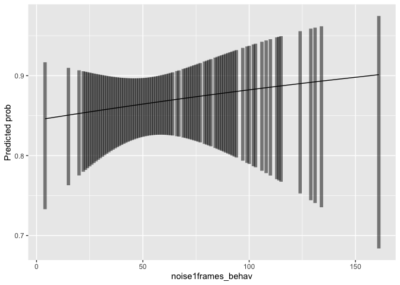
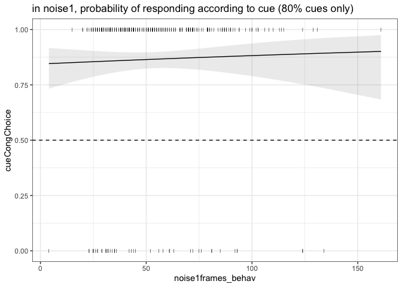

Pilot analyses: version 3
================

## data processing

``` r
inferenceData_tidy <- inferenceData %>%
  filter(is.na(response)==F) %>%
  mutate(cueType = factor(cueType),
         subID = factor(subID),
         resp1 = ifelse(response==1, 1, 0),
         resp2 = ifelse(response==1, 0, 1),
         respFinger = ifelse(resp1==1, '1', '2'),
         # signal1_rawEv = case_when(response==1 ~ signal1_target1,
         #                           response==2 ~ signal1_target2),
         # signal1_relEv = case_when(response==1 ~ signal1_target1 - signal1_target2,
         #                           response==2 ~ signal1_target2 - signal1_target1),
         # signal1_relEv_z = scale(signal1_relEv),
         # signal1_cueCong = case_when(cueIdx==1 & (signal1_target1 > signal1_target2) ~ '0.8 cue: congruent vizEv',
         #                             cueIdx==1 & (signal1_target1 < signal1_target2) ~ '0.8 cue: incongruent vizEv',
         #                             cueIdx==2 & (signal1_target1 > signal1_target2) ~ '0.8 cue: incongruent vizEv',
         #                             cueIdx==2 & (signal1_target1 < signal1_target2) ~ '0.8 cue: congruent vizEv',
         #                             cueIdx<3 & (signal1_target1 == signal1_target2) ~ '0.8 cue: equal vizEv',
         #                             cueIdx==3 & (signal1_target1 > signal1_target2) ~ '0.5 cue: imgA vizEv',
         #                             cueIdx==3 & (signal1_target1 < signal1_target2) ~ '0.5 cue: imgB vizEv',
         #                             cueIdx==3 & (signal1_target1 == signal1_target2) ~ '0.5 cue: equal vizEv'),
         # signal1_evCongChoice = case_when(signal1_target1 > signal1_target2 & response==1 ~ 1,
         #                                  signal1_target1 < signal1_target2 & response==2 ~ 1,
         #                                  signal1_target1 < signal1_target2 & response==1 ~ 0,
         #                                  signal1_target1 > signal1_target2 & response==2 ~ 0),
         # signal2_cueCong = case_when(cueIdx==1 & (signal2_target1 > signal2_target2) ~ '0.8 cue: congruent vizEv',
         #                             cueIdx==1 & (signal2_target1 < signal2_target2) ~ '0.8 cue: incongruent vizEv',
         #                             cueIdx==2 & (signal2_target1 > signal2_target2) ~ '0.8 cue: incongruent vizEv',
         #                             cueIdx==2 & (signal2_target1 < signal2_target2) ~ '0.8 cue: congruent vizEv',
         #                             cueIdx<3 & (signal2_target1 == signal2_target2) ~ '0.8 cue: equal vizEv',
         #                             cueIdx==3 & (signal2_target1 > signal2_target2) ~ '0.5 cue: imgA ev',
         #                             cueIdx==3 & (signal2_target1 < signal2_target2) ~ '0.5 cue: imgB ev',
         #                             cueIdx==3 & (signal2_target1 == signal2_target2) ~ '0.5 cue: equal ev'),
         # signal2_cueCong = factor(signal2_cueCong),
         # signal1_cueCong = factor(signal1_cueCong),
         noise1_seconds = noise1frames_behav * (1/60), 
         signal1RT = RT - noise1_seconds,
         vizLocked_respFrame = respFrame - noise1frames_behav,
         vizLocked_respFrame_t = vizLocked_respFrame / 60,
         vizLocked_sig2Resp = respFrame - (noise1frames_behav + signal1frames_behav + noise2frames_behav),
         vizLocked_sig2Resp = vizLocked_sig2Resp/60) %>% 
  group_by(subID) %>%
  mutate(zlog_sig1RT = log(signal1RT),
         zlog_sig1RT = scale(zlog_sig1RT))%>%
  ungroup()
```

## Effect of cue type on RT across all test trials

``` r
# run model
m <- inferenceData_tidy %>%
  filter(catch_trial == 0) %>%
  lm(zlogRT ~ cueType, ., contrasts=list(cueType=contr.sum))

# compute expected marginal means
emm <- emmeans(m, eff ~ cueType)

# quick plot
emmip(m,  ~ cueType, CIs=T, plotit=T) + 
  theme_bw() +  geom_hline(yintercept=0, linetype='dashed')
```

<!-- -->

``` r
# save plot-formatted emmeans
emm_df <- emmip(m,  ~ cueType, CIs=T, plotit=F)

# plot emmeans above raw data
inferenceData_tidy %>%
  filter(catch_trial == 0) %>%
  ggplot(aes(x = cueType, y = zlogRT)) +
  theme_bw() + 
  geom_hline(yintercept=0, linetype='dashed') +
  geom_point(aes(color=cueType), alpha=0.1, color='gray50', position=position_jitter(width=0.1)) +
  # add emmeans
  geom_errorbar(aes(x=xvar, y=yvar, ymin=LCL, ymax=UCL, color=cueType), data=emm_df, width=0.05, size=1) +
  labs(title = 'marginal means over raw data')
```

<!-- -->

``` r
summary(m)
```

    ## 
    ## Call:
    ## lm(formula = zlogRT ~ cueType, data = ., contrasts = list(cueType = contr.sum))
    ## 
    ## Residuals:
    ##     Min      1Q  Median      3Q     Max 
    ## -4.0655 -0.7562  0.0842  0.7780  2.5244 
    ## 
    ## Coefficients:
    ##             Estimate Std. Error t value Pr(>|t|)    
    ## (Intercept)  0.09634    0.02794   3.448 0.000576 ***
    ## cueType1     0.16182    0.02794   5.792 8.06e-09 ***
    ## ---
    ## Signif. codes:  0 '***' 0.001 '**' 0.01 '*' 0.05 '.' 0.1 ' ' 1
    ## 
    ## Residual standard error: 0.9915 on 1976 degrees of freedom
    ## Multiple R-squared:  0.0167, Adjusted R-squared:  0.0162 
    ## F-statistic: 33.55 on 1 and 1976 DF,  p-value: 8.058e-09

## For noise 1 responses only, probability of making cue-based response as a function of noise1 duration

``` r
# filter data & fit model
m <- inferenceData_tidy %>%
  filter(catch_trial == 0) %>%
  filter(respPeriod == 'noise1') %>%
  glm(cueCongChoice ~ noise1frames_behav, ., family='binomial')

# compute expected marginal means
emm <- emmeans(m, ~ noise1frames_behav, type='response', cov.reduce=quantile)

# quick plot
emmip(m, ~ noise1frames_behav, type='response', CIs=T, cov.reduce=F)
```

<!-- -->

``` r
# save plot-formatted emmeans
emm_df <- emmip(m,  ~ noise1frames_behav, type='response', CIs=T, plotit=F, cov.reduce=F)

# plot emmeans above raw data
inferenceData_tidy %>%
  filter(catch_trial == 0) %>%
  filter(respPeriod == 'noise1') %>%
  ggplot(aes(x = noise1frames_behav, y = cueCongChoice)) +
  theme_bw() + 
  geom_hline(yintercept=0.5, linetype='dashed') +
  geom_point(shape = '|') +
  # add emmeans
  geom_ribbon(aes(x=xvar, y=yvar, ymin=LCL, ymax=UCL), data=emm_df, alpha=0.1) +
  geom_line(aes(x=xvar, y=yvar), data=emm_df) +
  labs(title = 'in noise1, probability of responding according to cue (80% cues only)')
```

<!-- -->

``` r
summary(m)
```

    ## 
    ## Call:
    ## glm(formula = cueCongChoice ~ noise1frames_behav, family = "binomial", 
    ##     data = .)
    ## 
    ## Deviance Residuals: 
    ##     Min       1Q   Median       3Q      Max  
    ## -2.1151   0.5146   0.5370   0.5512   0.5688  
    ## 
    ## Coefficients:
    ##                    Estimate Std. Error z value Pr(>|z|)    
    ## (Intercept)        1.691186   0.378074   4.473 7.71e-06 ***
    ## noise1frames_behav 0.003228   0.006586   0.490    0.624    
    ## ---
    ## Signif. codes:  0 '***' 0.001 '**' 0.01 '*' 0.05 '.' 0.1 ' ' 1
    ## 
    ## (Dispersion parameter for binomial family taken to be 1)
    ## 
    ##     Null deviance: 270.08  on 341  degrees of freedom
    ## Residual deviance: 269.84  on 340  degrees of freedom
    ##   (31 observations deleted due to missingness)
    ## AIC: 273.84
    ## 
    ## Number of Fisher Scoring iterations: 4

``` r
print(emm)
```

    ##  noise1frames_behav  prob     SE  df asymp.LCL asymp.UCL
    ##                   4 0.846 0.0461 Inf     0.733     0.917
    ##                  34 0.858 0.0241 Inf     0.804     0.899
    ##                  46 0.863 0.0193 Inf     0.820     0.897
    ##                  70 0.872 0.0221 Inf     0.822     0.909
    ##                 161 0.901 0.0654 Inf     0.684     0.975
    ## 
    ## Confidence level used: 0.95 
    ## Intervals are back-transformed from the logit scale

## For signal 2 responses only, probability of making cue-based response

``` r
# filter data & fit model
# m <- test_trials %>% 
#   filter(...) %>%
#   lm(...)
# 
# # compute expected marginal means
# emm <- emmeans()
# 
# # quick plot
# emmip(,
#       CIs=T, cov.reduce=F)
# 
# # save plot-formatted emmeans
# emm_df <- emmip(,
#                 CIs=T, plotit=F, cov.reduce=F)
# 
# # plot emmeans above raw data
# test_trials %>%
#   filter() %>%
#   ggplot(aes(x = noise1frames_behav, y = cueCongChoice)) +
#   theme_bw() + 
#   geom_hline(yintercept=0.5, linetype='dashed') +
#   geom_point(shape = '|') +
#   # add emmeans
#   geom_ribbon(aes(x=xvar, y=yvar, ymin=LCL, ymax=UCL), data=emm_df, alpha=0.1) +
#   geom_line(aes(x=xvar, y=yvar), data=emm_df) +
#   labs(title = 'in noise1, probability of responding according to cue (80% cues only)')
# 
# summary(m)
# print(emm)
```

``` r
# run model
m <- inferenceData_tidy %>%
  lm(zlogRT ~ noise1frames_behav + cueType, ., contrasts = list(cueType = contr.sum))

# extract coefficient values
estimates <- as.data.frame(stack(coef(m)))

# compute expected marginal means
emm <- emmeans(m, eff ~ noise1frames_behav | cueType, cov.reduce=range)

# quick plot
emmip(m,  ~ noise1frames_behav | cueType, cov.reduce=quantile, CIs=T, plotit=T)
```

<!-- -->

``` r
# save plot-formatted emmeans
emm_df <- emmip(m,  ~ noise1frames_behav | cueType, CIs=T, plotit=F, 
                at=list(noise1frames_behav = unique(inferenceData_tidy$noise1frames_behav)))


# plot emmeans above raw data
inferenceData_tidy %>%
  ggplot(aes(x = noise1frames_behav, y = zlogRT)) +
  theme_bw() + 
  facet_wrap(~ cueType, scales = 'free') +
  geom_hline(yintercept=0) +
  geom_point(aes(color=cueType), alpha=0.15, color='black') +
  geom_ribbon(aes(xvar, yvar, ymin=LCL, ymax=UCL, fill=cueType), emm_df, color=NA, alpha=0.5) +
  geom_line(aes(x=xvar, y=yvar), data=emm_df) +
  labs(title = 'effect of cue type & noise1 duration on RTs')
```

<!-- -->

``` r
summary(m)
```

    ## 
    ## Call:
    ## lm(formula = zlogRT ~ noise1frames_behav + cueType, data = ., 
    ##     contrasts = list(cueType = contr.sum))
    ## 
    ## Residuals:
    ##     Min      1Q  Median      3Q     Max 
    ## -3.5103 -0.5789  0.0531  0.6306  2.5029 
    ## 
    ## Coefficients:
    ##                      Estimate Std. Error t value Pr(>|t|)    
    ## (Intercept)        -1.4291497  0.0746927  -19.13  < 2e-16 ***
    ## noise1frames_behav  0.0172457  0.0007989   21.59  < 2e-16 ***
    ## cueType1            0.0980497  0.0241490    4.06 5.08e-05 ***
    ## ---
    ## Signif. codes:  0 '***' 0.001 '**' 0.01 '*' 0.05 '.' 0.1 ' ' 1
    ## 
    ## Residual standard error: 0.8987 on 2182 degrees of freedom
    ## Multiple R-squared:  0.1904, Adjusted R-squared:  0.1897 
    ## F-statistic: 256.6 on 2 and 2182 DF,  p-value: < 2.2e-16
